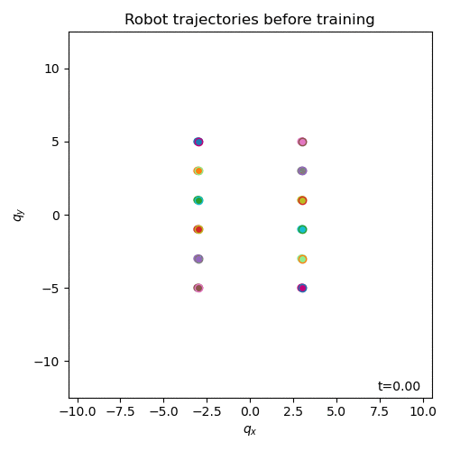
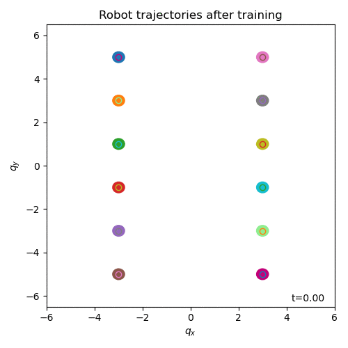

# Deep Distributed Control of Port-Hamiltonian Systems (DeepDisCoPH)

This repository is associated to the paper **[1]** and it contains:
1) The full paper manuscript.
2) The code to reproduce numerical experiments.

## Summary
By embracing the compositional properties of port-Hamiltonian (pH) systems, 
we characterize deep Hamiltonian control policies with <i>built-in</i> 
closed-loop stability guarantees — irrespective of the interconnection 
topology and the chosen neural network parameters. Furthermore, our setup 
enables leveraging recent results on well-behaved neural ODEs to prevent 
the phenomenon of vanishing gradients by design **[2]**. 
The numerical experiments described in the report and available in this repository 
corroborate the dependability of the proposed **DeepDisCoPH** architecture, 
while matching the performance of general neural network policies.

## Report

The [report](docs/Report.pdf) as well as the corresponding [Appendices](docs/SupportingMaterial.pdf) can be found in the `docs` folder.

## Installation of DeepDisCoPH
The following lines indicates how to install the Deep Distributed Control for Port-Hamiltonian Systems (DeepDisCoPH) package.

```bash
git clone https://github.com/DecodEPFL/DeepDisCoPH.git

cd DeepDisCoPH

python setup.py install
```

## Basic usage

To train distributed controllers for the 12 robots in the <i>xy</i>-plane:

```bash
./run.py --model [MODEL]
```
where available values for `MODEL` are `distributed_HDNN`, `distributed_HDNN_TI` and `distributed_MLP`.

To plot the norms of the backward sensitivity matrices (BSMs) when training 
a distributed H-DNN as the previous example, run:
```bash
./bsm.py --layer [LAYER]
```
where available values for `LAYER` are 1,2,...,100. If `LAYER`=-1, then it is set to <i>N</i>.
The `LAYER` parameter indicates the layer number at which we consider the loss function is evaluated.

## Examples: formation control with collision avoidance
The following gifs show the trajectories of the robots before and after the training of a distributed H-DNN controller. The goal is to reach the target positions within T = 5 seconds while **avoiding collisions**. 

<p align="center">


</p>
Training performed for <i>t</i> in [0,5]. Trajectories shown for <i>t</i> in [0,6], highlighting that robots stay close to the desired position when the time horizon is extended. 

## References
[[1]](docs/Report.pdf)
Luca Furieri, Clara L. Galimberti, Muhammad Zakwan and Giancarlo Ferrrari Trecate.
"Distributed neural network control with dependability guarantees: a compositional port-Hamiltonian approach",
under review.

[[2]](https://arxiv.org/pdf/2105.13205.pdf)
Clara L. Galimberti, Luca Furieri, Liang Xu and Giancarlo Ferrrari Trecate.
"Hamiltonian Deep Neural Networks Guaranteeing Non-vanishing Gradients by Design,"
arXiv:2105.13205, 2021.
